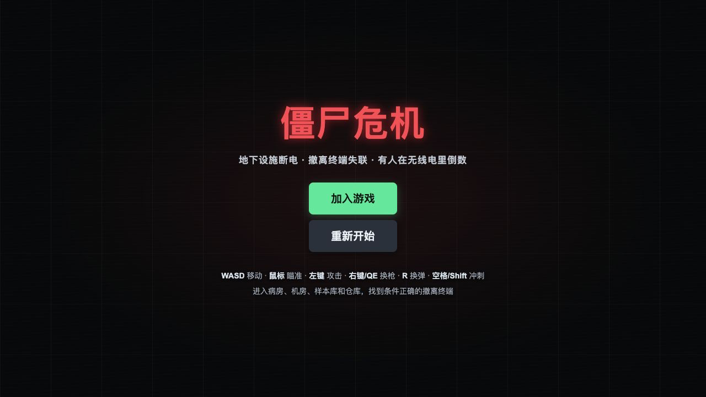
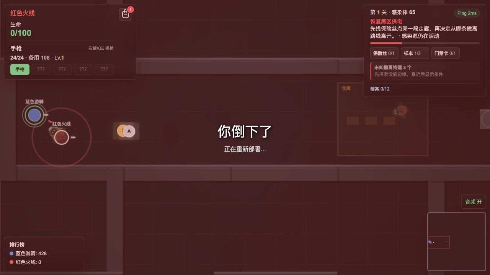
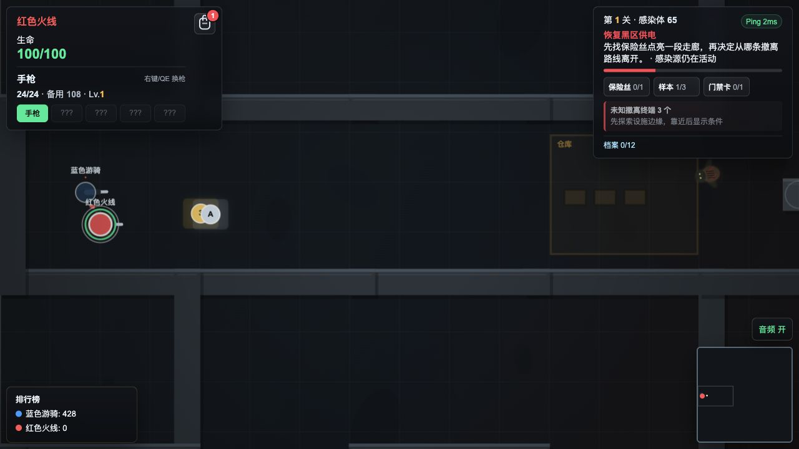
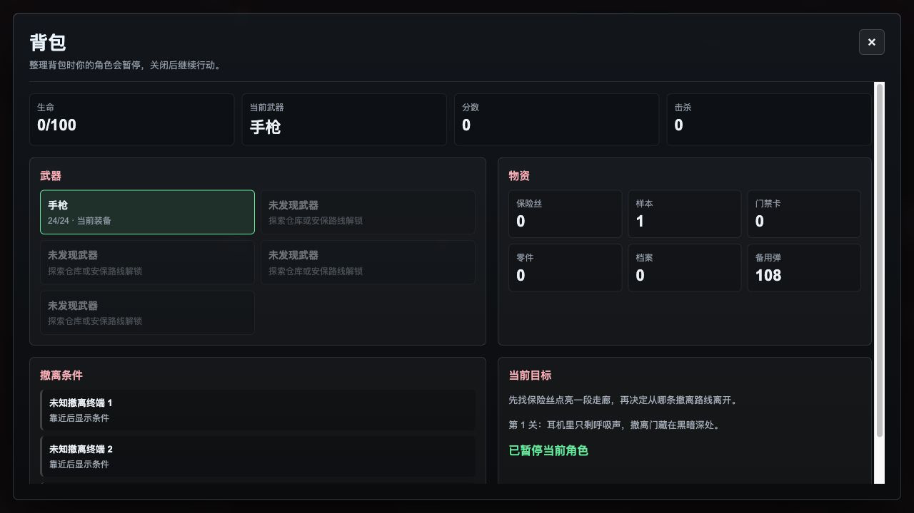

# 僵尸危机

一个轻量的多人联机恐怖撤离生存游戏。



## 快速开始

> 需要 Python 3.10+ 和 git

**一键安装 / 升级并启动（已安装过会自动 git pull）：**

```bash
/bin/bash -c "$(curl -fsSL https://raw.githubusercontent.com/hellojuantu/zombie_crisis/refs/heads/main/install.sh)"
```

启动后自动打开浏览器，或手动访问：

| 模式 | 地址 |
|---|---|
| 多人联机 | `http://localhost:8080/` |
| 单人模式（纯前端，无需联机） | `http://localhost:8080/solo` |

### 局域网联机

让朋友在同一网络下访问你的局域网 IP：

```
http://你的局域网IP:8080/
```

查看本机 IP：`ipconfig getifaddr en0`（Mac）或 `ipconfig`（Windows）

---

## 操作

| 按键 | 行为 |
|---|---|
| WASD | 移动 |
| 鼠标 | 瞄准 |
| 左键 | 开火（贴脸自动切刀近战） |
| 右键 / Q / E / 1-5 | 切换已解锁武器 |
| R | 换弹 |
| 空格 / Shift | 冲刺 |
| 背包图标 | 打开全屏背包，查看武器、物资、撤离条件和路线奖励 |

---

## 玩法

每局目标：在设施内收集物资、完成撤离条件，并成功从撤离点读条离开，进入下一层。

**收集**
- 保险丝在设施各处搜寻，病毒样本和门禁卡需击杀特定感染体掉落

**设施交互**
- 病房可止血，但会引怪
- 机房消耗保险丝后可定位撤离点
- 样本库提高样本掉落，但触发共振
- 仓库搜出武器、载具和补给，但触发警报

**撤离**
- 每关有多个撤离点（地图标记 1/2/3），撤离要求和奖励不同
- 未供电时撤离点不可见，需靠近或为机房供电后显形

**升级与压力**
- 连杀 10/20/30 获得短时射速/三连发/护盾加成
- 波次逐步解锁爬行者、重型、毒性、装甲、跳扑、尖啸、爆裂体等精英
- 第 3/6/9… 关出现 Boss，通关 6 关后揭露主线结局并进入无尽层

---

## 截图





---

## 开发者

<details>
<summary>架构、测试、压测</summary>

**架构**

- `server_game/`：服务端权威模拟，不含浏览器或渲染逻辑
- `server_asgi.py`：ASGI + Socket.IO 生产入口
- `static/js/game/`：前端游戏主循环、渲染、HUD、特效
- `static/js/protocol.js`：紧凑快照协议解码
- `tools/load_test.py`：Socket.IO 压测脚本

**格式化**

```bash
npm install
npm run format
npm run format:check
```

**测试**

```bash
python3 -m unittest discover -s tests -v
node tests/test_protocol.js
node tests/test_prediction.js
node tests/test_interpolation.js
node tests/test_camera.js
node tests/test_timing.js
node tests/test_netcode.js
```

**压测**

```bash
python3 tools/load_test.py --clients 100 --duration 10 --ramp 0.01 --input-interval 0.066 --shoot-duty 0.85
```

**性能策略**

- WebSocket only，避免轮询退化
- 服务端权威，客户端预测与插值
- AOI 视野裁剪，减少 100 人同步包大小
- 网络快照 16Hz，服务端模拟 30Hz
- 高频事件按附近玩家定向发送

</details>
